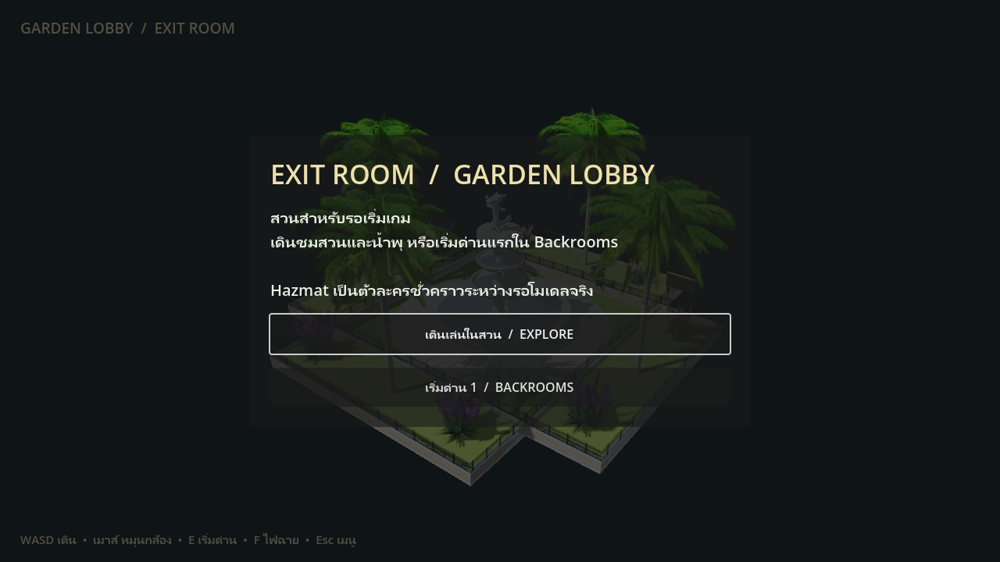
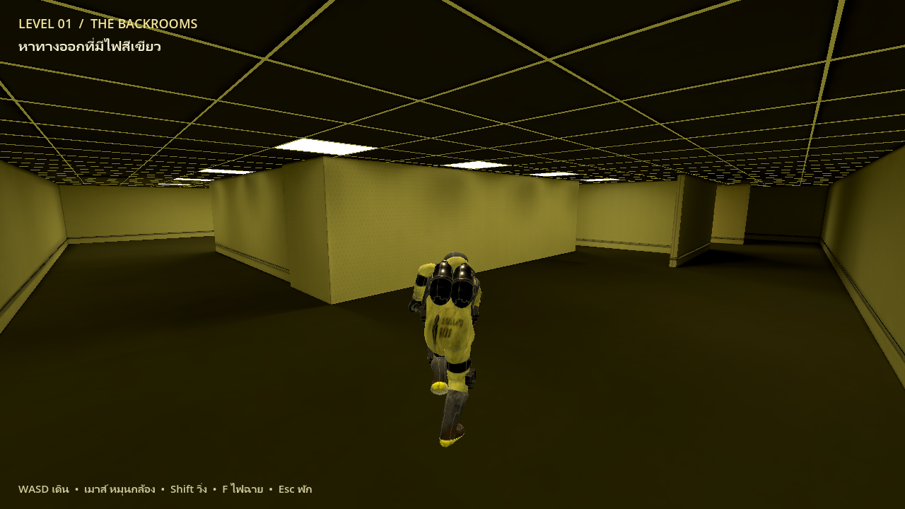

# ExitRoom

เกมต้นแบบมุมมองบุคคลที่ 3 ได้แรงบันดาลใจมาจากเกม EscapeBackroom

## เปิดเล่น

ที่ lobby เลือก **เดินเล่นในสวน** เพื่อควบคุม Hazmat หรือเลือก **เริ่มด่าน 1 / BACKROOMS** เพื่อเข้าเล่นทันที เดินไปที่ป้ายในสวนแล้วกด E ก็เริ่มด่านได้

ใน Backrooms เดินหาไฟทางออกสีเขียว กด E เพื่อกลับสวน

- WASD: เดิน
- เมาส์: หมุนกล้อง
- Shift: วิ่ง
- F: เปิด/ปิดไฟฉาย
- E: ใช้งานป้ายเริ่มด่านหรือทางออก
- Esc: เมนู/พัก

Hazmat ใช้ เป็นตัวละครชั่วคราวระหว่างรอโมเดลจริง
