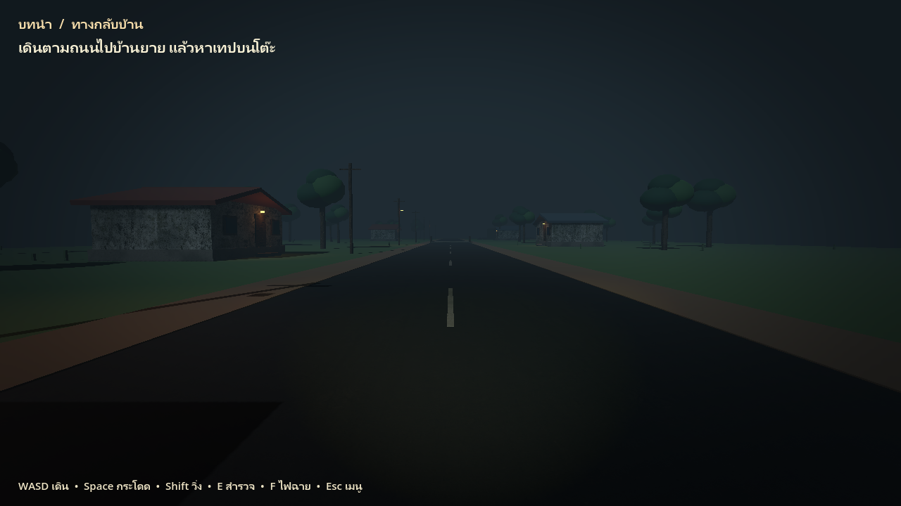
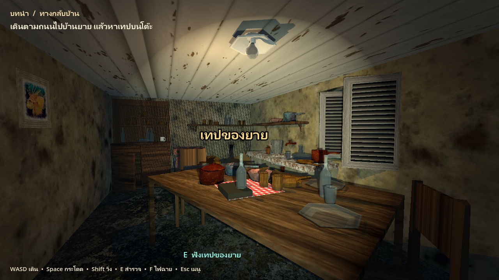
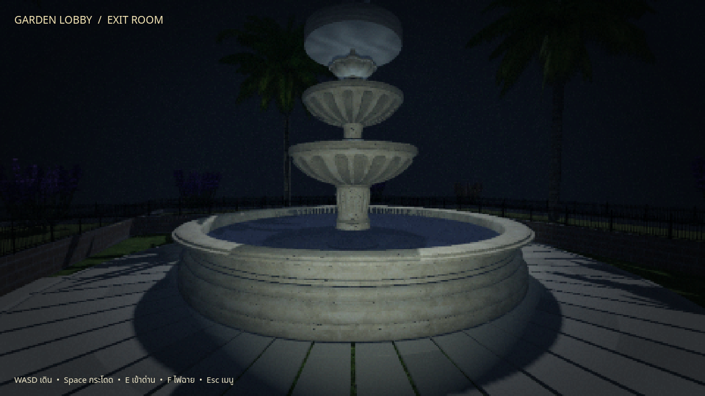
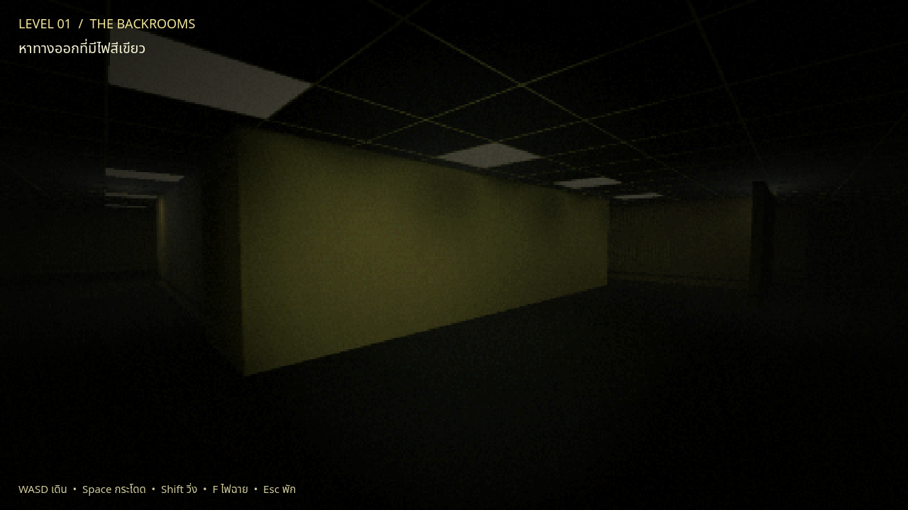
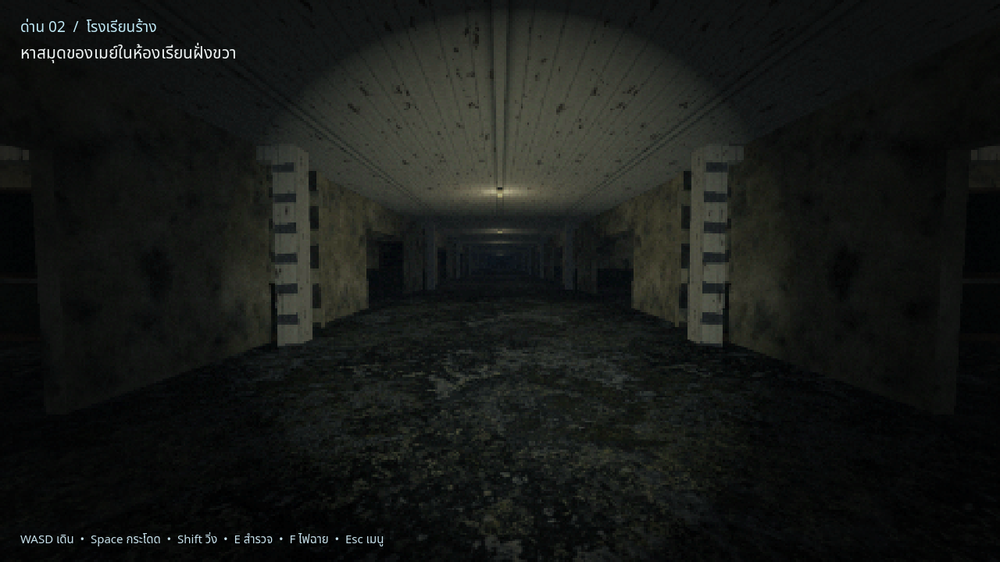

# ExitRoom

ลำดับเกมต้นแบบคือ **ทางกลับบ้านต่างจังหวัด → บ้านยาย → สวน (lobby) → Backrooms (ด่านแรก) → กลับสวน → โรงเรียนร้าง (ด่านสอง) → กลับสวน**

## เปิดเล่น

เมื่อนำโปรเจกต์ลงเครื่องครั้งแรก ให้เปิด `project.godot` ใน Godot และรอให้นำเข้าโมเดลกับเท็กซ์เจอร์เสร็จ แล้วกด F5 หลังจากนั้นใช้ `Play.cmd` เพื่อเปิดเล่นได้

ฉากเปิด `prologue_village.tscn` เป็นหมู่บ้าน low-poly ที่แยกชิ้นส่วนไว้ใน Scene Tree มีถนนยาว บ้านข้างทาง ทุ่งนา สะพาน และบ้านยาย เดินตามถนนแล้วเลี้ยวขวาที่ทางเข้าบ้านยาย ฟังเทปบนโต๊ะ เก็บลูกแก้วที่ทางด้านข้างบ้าน จากนั้นเดินไปประตูหลังบ้านเพื่อเข้าสวน โมเดล Hazmat ยังเป็นตัวละครชั่วคราว

ที่ lobby เลือก **เดินเล่นในสวน** เพื่อควบคุม Hazmat หรือเลือก **เริ่มด่าน 1 / BACKROOMS** เพื่อเข้าเล่นทันที เดินไปที่ป้ายในสวนแล้วกด E ก็เริ่มด่านได้

ใน Backrooms เดินหาไฟทางออกสีเขียว กด E เพื่อกลับสวน

เมื่อผ่าน Backrooms แล้ว ป้าย **โรงเรียนร้าง / ด่าน 2** ที่สวนจะเปิดให้เข้าได้ โรงเรียนเป็นฉาก low-poly เดินสำรวจตามโถงยาว ผ่านเสาคอนกรีตและห้องเรียน ค้นหาสมุดของเมย์ในห้องเรียนฝั่งขวา กุญแจห้องเอกสารในห้องเรียนฝั่งซ้าย เปิดระบบประกาศที่ปลายทาง แล้วออกทางประตูสีเขียวเพื่อกลับสวน ฉาก `abandoned_school.tscn` แยกชิ้นส่วนไว้ให้แก้ใน Godot ได้ โดยสร้างต้นแบบจาก `tools/build_school.gd`

- WASD: เดิน
- เมาส์: หมุนกล้อง
- Shift: วิ่ง
- Space: กระโดด (ขอบพื้นเตี้ยไม่เกินประมาณ 30 ซม. จะก้าวขึ้นเองเมื่อมีพื้นที่ด้านบน)
- F: เปิด/ปิดไฟฉาย
- E: ใช้งานป้ายเริ่มด่านหรือทางออก
- Esc: เมนู/พัก

กล้องอยู่ที่ระดับสายตาของผู้เล่นทุกด่าน ฉากปรับให้มืดลงและเปิดไฟฉายไว้ตอนเริ่ม กด F เพื่อเปิดหรือปิดเอง โมเดล Hazmat จาก `3Dmodel_import/backrooms_rigged_hazmat.glb` ยังอยู่ในโปรเจกต์เป็นตัวละครชั่วคราว แต่ซ่อนจากกล้องบุคคลที่หนึ่งเพื่อไม่ให้หมวกบังภาพ สวนใช้ `assets/garden_fountain_toothless.glb` และด่านแรกใช้ `3Dmodel_import/original_backrooms.glb`

บรรยากาศใหม่ใช้หมอกและแสงเย็นในหมู่บ้าน สวน และโรงเรียน ส่วน Backrooms ปรับวัสดุผนัง/พื้นของ GLB ที่เดิมไม่รับแสงให้เกิดเงาจริง พร้อมไฟเพดานบางดวงกะพริบ ทุกด่านมีเสียงพื้นหลังเบา ๆ และขอบภาพมืดเล็กน้อยเพื่อเน้นทางที่ไฟฉายส่อง

ภาพทุกฉากผ่าน shader `assets/shaders/retro_horror.gdshader` เพื่อให้เป็นพิกเซลย้อนยุค เบลอเล็กน้อย มีเกรนและเงาอมฟ้า ส่วน HUD และเมนูยังคมชัด ปรับความหยาบด้วย `pixel_height` (ค่าเริ่มต้น 270; เพิ่มเพื่อให้ละเอียดขึ้น) ความเบลอด้วย `softness` และความสว่างด้วย `exposure` ได้จากค่าเริ่มต้นในไฟล์ shader

เท็กซ์เจอร์ฉากเปิด 1K ใช้ภาพ CC0 จาก Poly Haven ได้แก่ [Worn Plaster Wall](https://polyhaven.com/a/worn_plaster_wall), [Worn Concrete Floor](https://polyhaven.com/a/worn_concrete_floor), [Weathered Planks](https://polyhaven.com/a/weathered_planks) และ [Asphalt 06](https://polyhaven.com/a/asphalt_06) การวางฉากเริ่มต้นสร้างด้วย `tools/build_prologue.gd` และสามารถแก้ชิ้นส่วนโดยตรงใน Godot ได้

## เพิ่มโมเดล `.glb`

วางไฟล์ที่ `3Dmodel_import/` ในโปรเจกต์นี้ เปิด Godot แล้วรอแถบ Import ทำงานจนเสร็จ เก็บไฟล์ texture ที่มากับโมเดลไว้ด้วยถ้ามี และส่งชื่อไฟล์หรือบอกตำแหน่งที่ต้องการวาง ผมจะตรวจขนาด วัสดุ และจุดสัมผัสพื้นก่อนนำเข้าไปแทนชิ้นต้นแบบ โดยไม่ต้องโหลดทุกอย่างพร้อมกัน โมเดลที่ช่วยฉากโรงเรียนมากที่สุดคือโต๊ะ/เก้าอี้เรียน ตู้ล็อกเกอร์ ประตูเก่า และเศษซากเล็ก ๆ; ฉากเปิดคือเฟอร์นิเจอร์บ้านชนบท ป้ายร้าน และพืชข้างทาง ตรวจสิทธิ์การใช้และเก็บชื่อผู้สร้างไว้สำหรับไฟล์ที่ไม่ได้ให้ใช้แบบ CC0

เมนูใช้ฟอนต์ไทย `NotoSansThai.ttf` ที่รวมไว้ในโปรเจกต์ จึงแสดงข้อความไทยได้ทั้งบนคอมพิวเตอร์และเว็บ

## ปรับภาพบ้านร้างและทางเดิน (1 ตุลาคม 2026)

บ้านยายใช้โมเดล **Low-poly Furnished Abandoned House** ของ NeoKG ที่ผู้ใช้ส่งมา พร้อมเฟอร์นิเจอร์และวัสดุเดิม ทำสำเนาใน Blender เป็น `assets/abandoned_house_playable.glb` โดยเชื่อมรอยต่อชิ้นผนังและเปิดช่องทางเข้ากับช่องเข้าครัว 1.80 × 2.24 เมตร ไฟล์ต้นฉบับยังอยู่ที่ `3Dmodel_import/low-poly_furnished_abandoned_house.glb` บ้านวางที่ `(24, 0.03, -140)` หมุน Y 180 องศา สเกล 1 เท่า ตามขนาดประตูเดิมประมาณ 2 เมตร

บ้านในฉากแยก meshes และ collision ของผนัง พื้น และเฟอร์นิเจอร์หลัก ของเล็กไม่สร้าง collision เพื่อไม่ให้สะดุด ลดความแรง normal map และปรับแสงใน Godot ให้ผิวไม่แตกเป็นลาย โรงเรียนใช้วัสดุผนัง `M_Parede3` พื้น `M_PisoMusgo2` เพดาน `M_Forro` และไม้ `M_Madeira1` จากโมเดลเดียวกัน พร้อมเฟอร์นิเจอร์โรงเรียนที่สร้างแยกชิ้นในโปรเจกต์นี้

เปิด `PreviewHouse.cmd` เพื่อเริ่มหน้าบ้านยายและลองเดินเข้าห้องได้ทันที ส่วน `Play.cmd` เริ่มตามเนื้อเรื่องปกติ ปรับพื้นหน้าบ้านให้ต่อเนื่อง เพิ่มกระโดดและการก้าวขึ้นพื้นเตี้ย และย้ายกุญแจโรงเรียนกลับมาด้านในผนังห้องให้เข้าถึงได้

วัสดุสำหรับบ้านข้างทางและชิ้นประกอบอื่นใช้ Poly Haven (CC0): [Worn Mossy Plasterwall](https://polyhaven.com/a/worn_mossy_plasterwall), [Painted Plaster Wall](https://polyhaven.com/a/painted_plaster_wall), [Plastered Wall 02](https://polyhaven.com/a/plastered_wall_02), [Concrete Floor](https://polyhaven.com/a/concrete_floor), [Weathered Planks](https://polyhaven.com/a/weathered_planks). วัสดุเหล่านี้บางส่วนใช้ Godot shader และต้อง bake หากส่งออกนอก Godot อ่านเครดิตโมเดลบ้านและรายละเอียดการดัดแปลงใน `ASSET_CREDITS.md`

ตรวจการเล่นด้วย `tests/player_traversal.gd`, `tests/prologue_flow.gd`, `tests/school_flow.gd` และ `tests/lobby_flow.gd` ครอบคลุมการก้าวข้ามพื้น 22 ซม. การกระโดด การชนกำแพง เดินเข้าครัวจริง จุดเก็บของ และการเปลี่ยนด่าน
